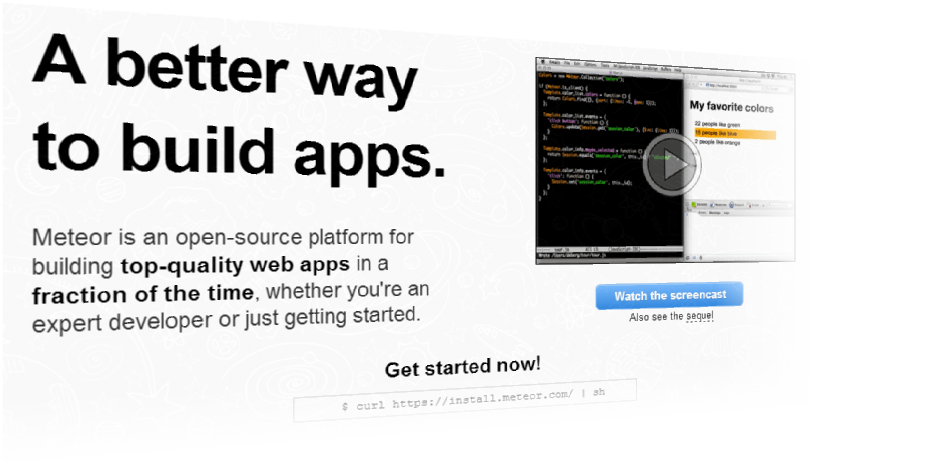
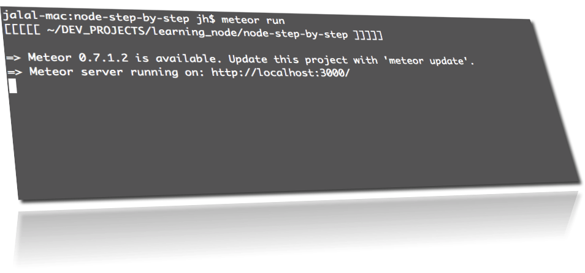
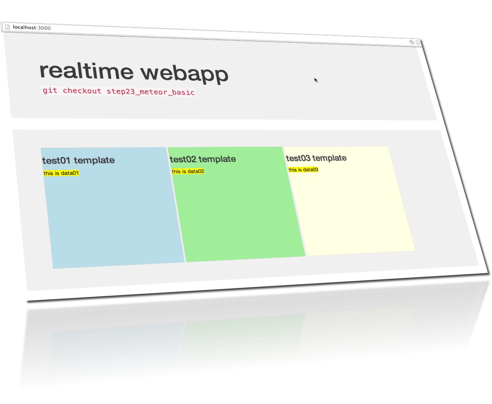
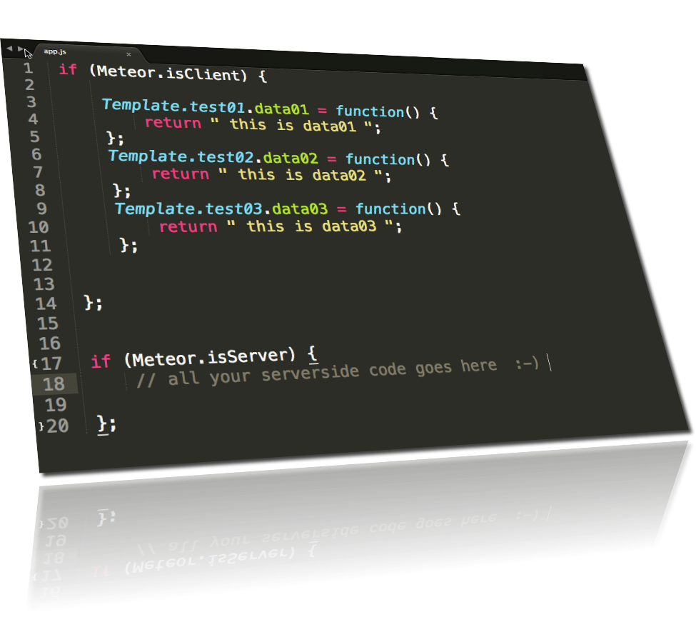

node-step-by-step
=================

## step23_meteor_basic

We are going to build modern realtime webapp like any professional webApp today.  
So we need a higher level framework than express and 100s of libraries to build better WebApps: 

* you get your development environment ready to work in any machine in 10 minutes. 
* you get a common language for both client and server
* Transferring data from server to the client and the other way around becomes a simple task.

## 01) install meteor (if you don't have it already)
    curl https://install.meteor.com/ | sh

## 02) run
    meteor run

## 03) browse
    localhost:3000

## discover the code

Take a look inside the app.js and index.html  
make some change to the code and watch your browser in realtime  

