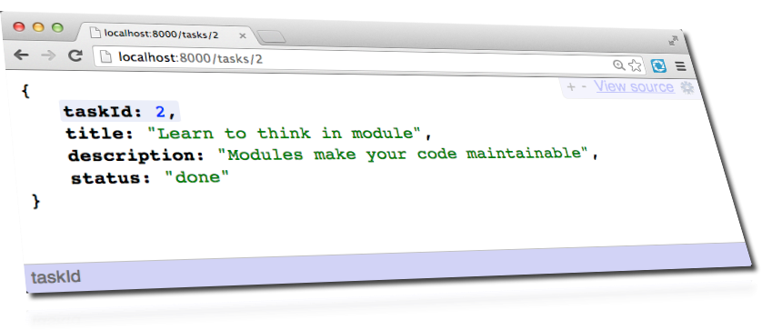

node-step-by-step
=================

building nodejs REST-API-repository-design-pattern

## Step14 (Data Access Layer Repository)

    $ npm install
    $ npm start

## Opgaven 

Venligst flytte alle kode der hører til Data Access ude af server.js til DAL.js som Modul. 
 
Du kan læse mere om denne løsning her: 

<a href="http://about_node.itacademy.dk/rest-api-repository-design-pattern/">
    REST-API-repository-design-pattern
</a>
    

 

