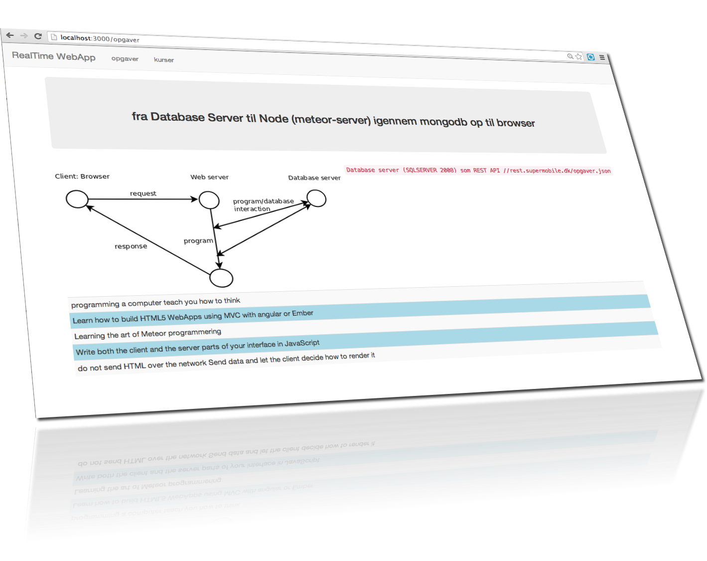

node-step-by-step
=================

## step26_meteor_serverside

 
 

 

med denne branch ønsker vi at brug HTTP.get() på serverside
i stedet for jQuery.ajax() på klientside.  
Server-side har bedre performance til at hente store mængde data
fra remote services. 

Send an HTTP GET request. Equivalent to HTTP.call("GET", ...).

## dokumenation til http_call
http://jalal.meteor.com/#http_call

## /Server/fixtures.js 

Med Server-side HTTP.get() hentes data fra servicen ved opstart kun første gang. 

