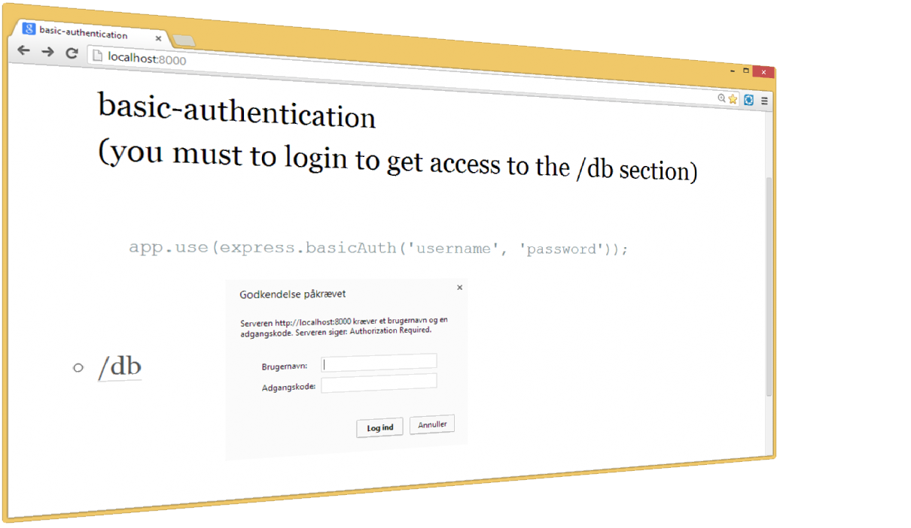

node-step-by-step
=================

## Step19_express_authentication

## basic-authentication

authenticate using username and password <a href="http://expressjs.com/3x/api.html#middleware">
    ExpressJS middleware   
</a> 

		app.use(express.basicAuth('username', 'password'));

 

