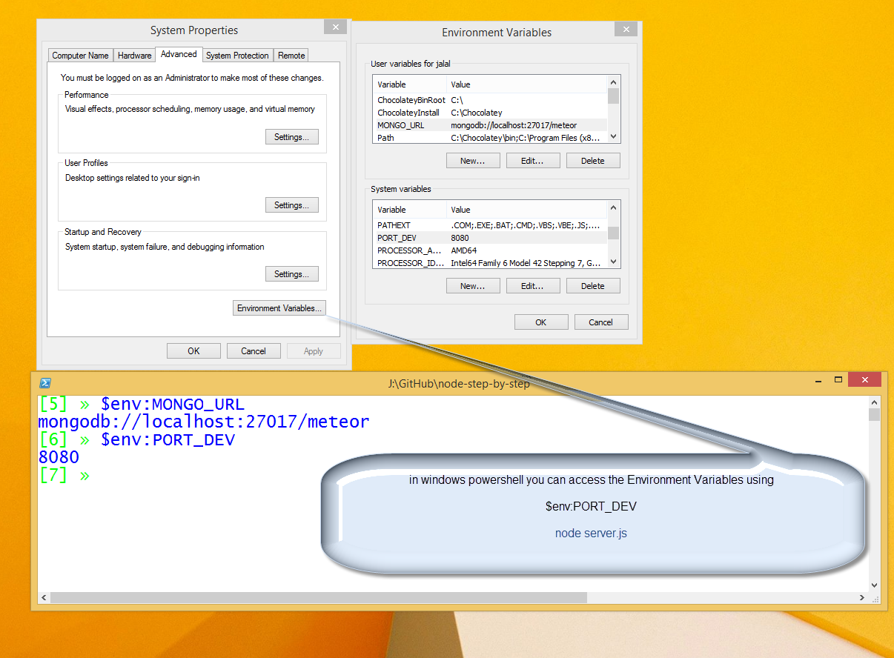
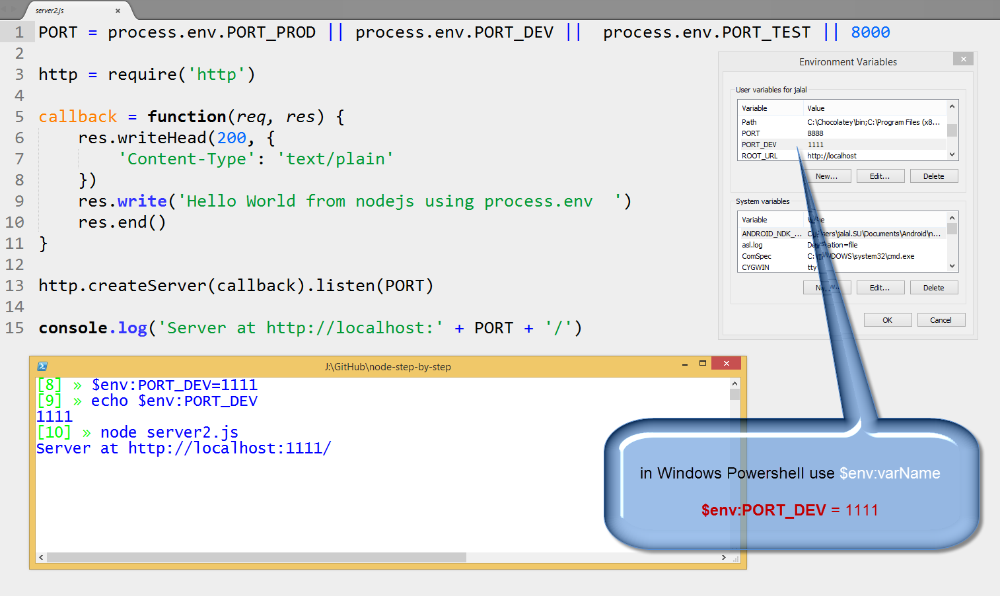
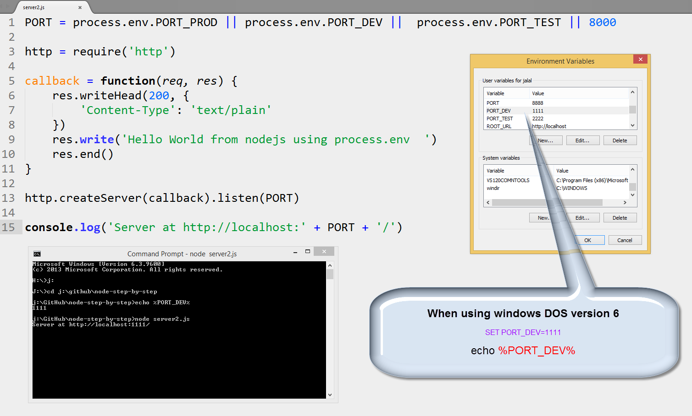
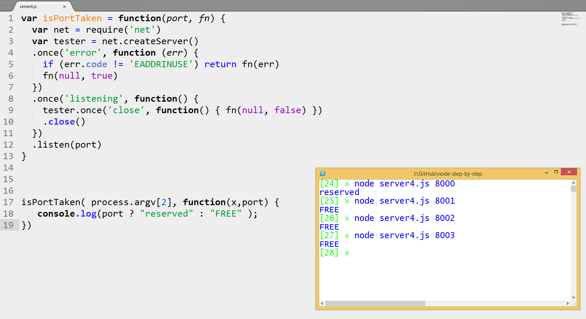
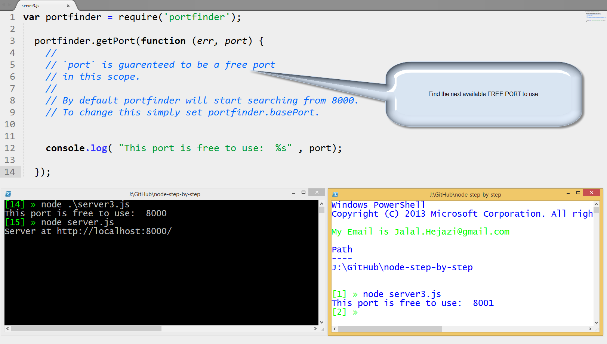

node-step-by-step
=================

building nodejs step by step (building chat server and later client )

## Step03

building the server side.

## Do NOT hardcode your PORT

Solving the problem of NOT to hardcode PORT inside your server.js  
inspiration from: <a href="http://nodejs.org/api/process.html#process_process_env">#process_process_env</a>

## When using MAC and Linux 

## When using Windows powershell

## When using Windows DOS

## RTFM

* Powershell ref.: <a href="http://technet.microsoft.com/en-us/library/ff730964.aspx">Environment_variables in powershell</a>

* DOS ref.: <a href="http://ss64.com/nt/syntax-variables.html">Environment_variables in DOS</a>

* Linux ref.: <a href="https://wiki.archlinux.org/index.php/Environment_variables">Environment_variables in Linux and Mac</a>

## How to ask if PORT is FREE or RESERVED

## How to find any FREE PORT? 

