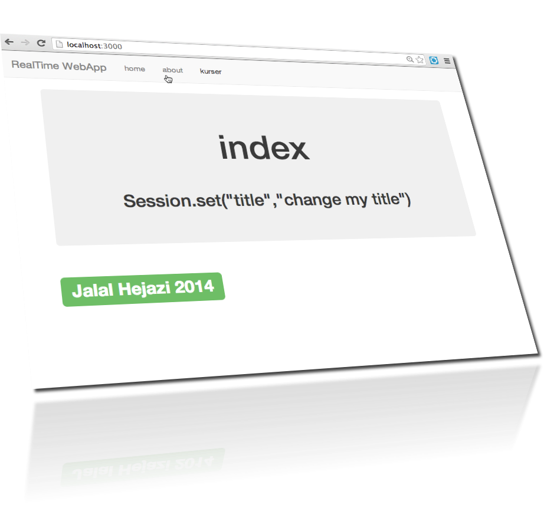
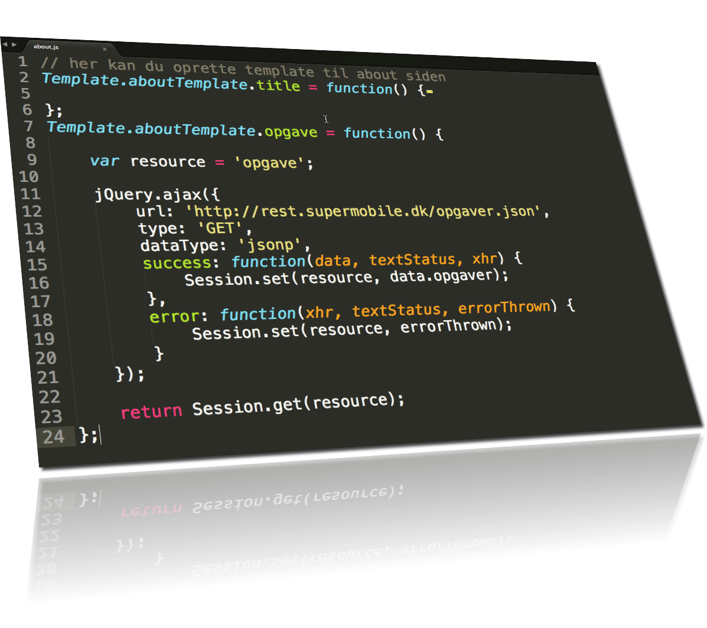

node-step-by-step
=================

## step24_meteor_structure

To reset your mongodb run this code

    > meteor reset

## Multi Page App - structure

Single Page App eller Multi Page App begge muligheder er op til udvikleren i meteor app. 

jeg har valgt at brug Multi Page App vha. client/lib/router.js

alle kode der hører til browseren er under mappen /client

alle kode der hører til serveren er under mappen /server

alle kode der hører til databasen er under mappen /Model

forklaring stammer fra http://jalal.meteor.com/#structuringyourapp

* Files in directories named lib are loaded first.

* Files that match main.* are loaded after everything else.

* Files in subdirectories are loaded before files in parent directories, so that files in the deepest subdirectory are loaded first (after lib), and files in the root directory are loaded last (other than main.*).

* Within a directory, files are loaded in alphabetical order by filename.

## browse

    > meteor run   

## get remote data

## client-side jQuery.ajax()

## meteor project structures

    /projectName
        /docs             - Documentation
        /src              - Root directory of all source files
            /client           - [Client only]
                /collections       - Local, unsynced collections
                /compatability     - 3rd party JS libs that export a global symbol
                /conf              - Configuration
                /lib               - Library code (client-only)
                /routers           - As the name implies, define routes here
                /startup           - Code to run on document.ready()
                /stylesheets       - CSS files
                /subscriptions     - Subscribe to publications
                /views             - Contains one nested directory for each module
            /collections       - [Client and Server] Collections and methods that act on the collection
            /lib               - [Client and Server] Library code that is used on client and server
            /packages          - [Client and Server] Meteor, Meteorite and local packages
            /private           - [Server only] Private data files
            /public            - Static files
                /images        - Image files
            /server            - [Server only]
                /publications  - Publish Mongo collections
                /startup       - Code to run when the server starts

