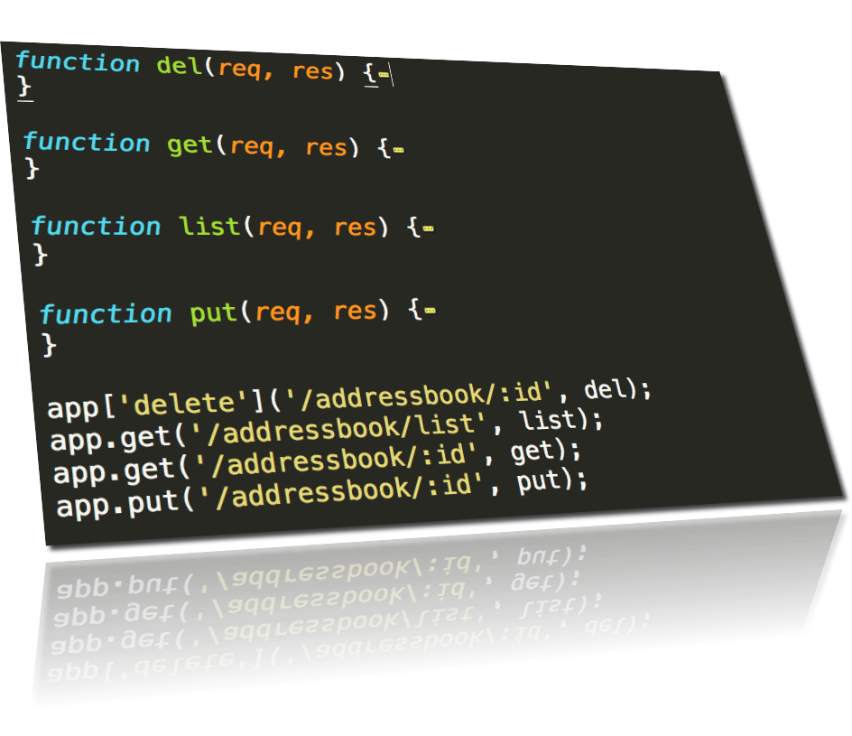
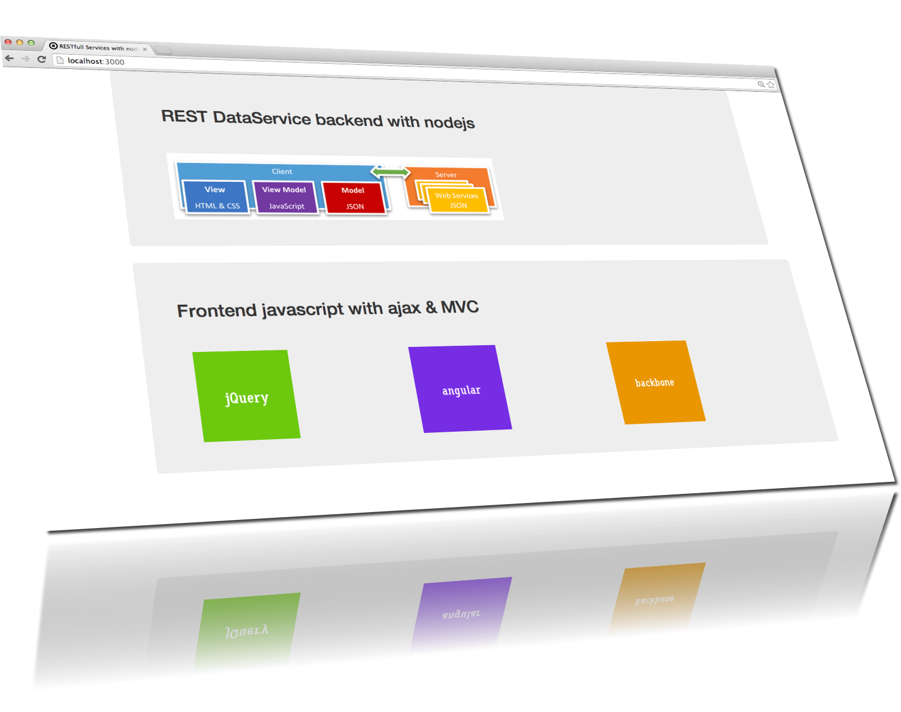

node-step-by-step
=================

building nodejs REST-API-SPA

## Step15_SPA_MemoryDB (addressbook)

REST DataService backend and Single Page App frontend

## usage: 

    $ npm install
    $ npm start

