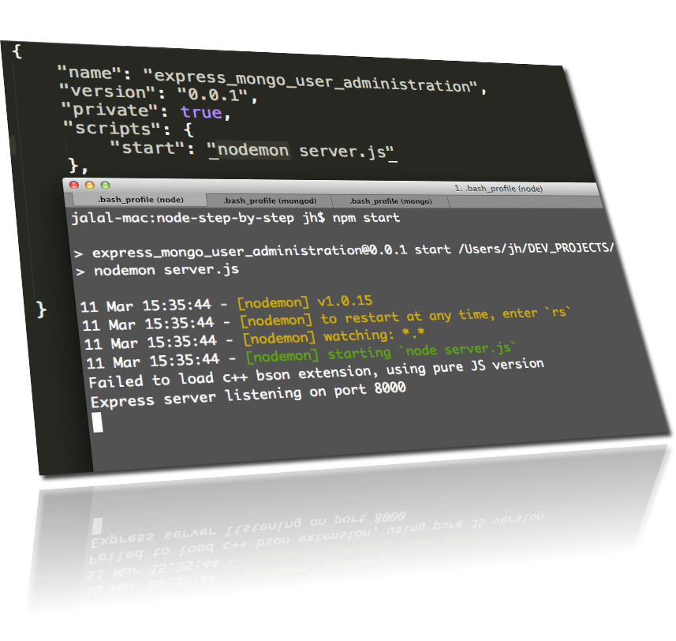
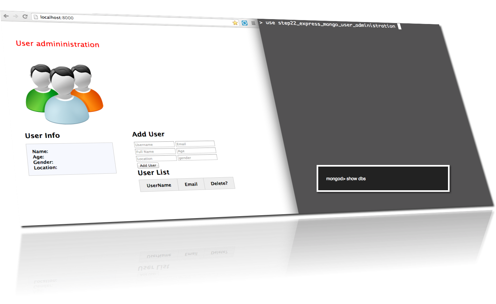
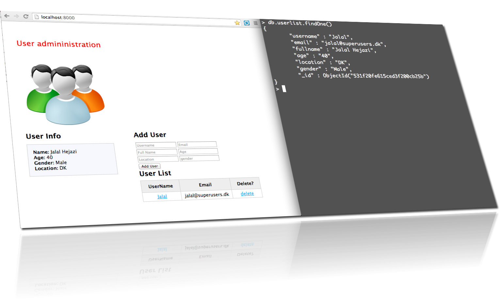
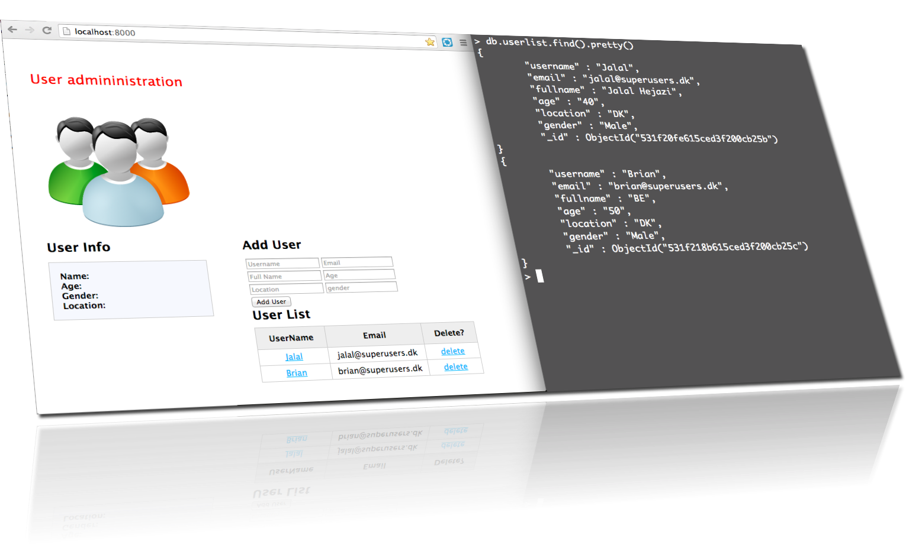
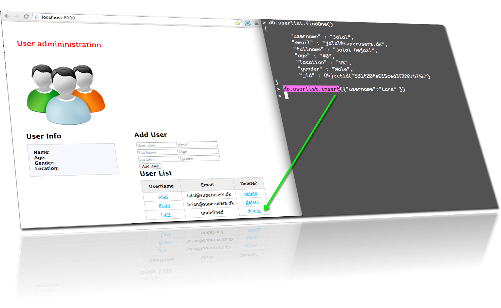
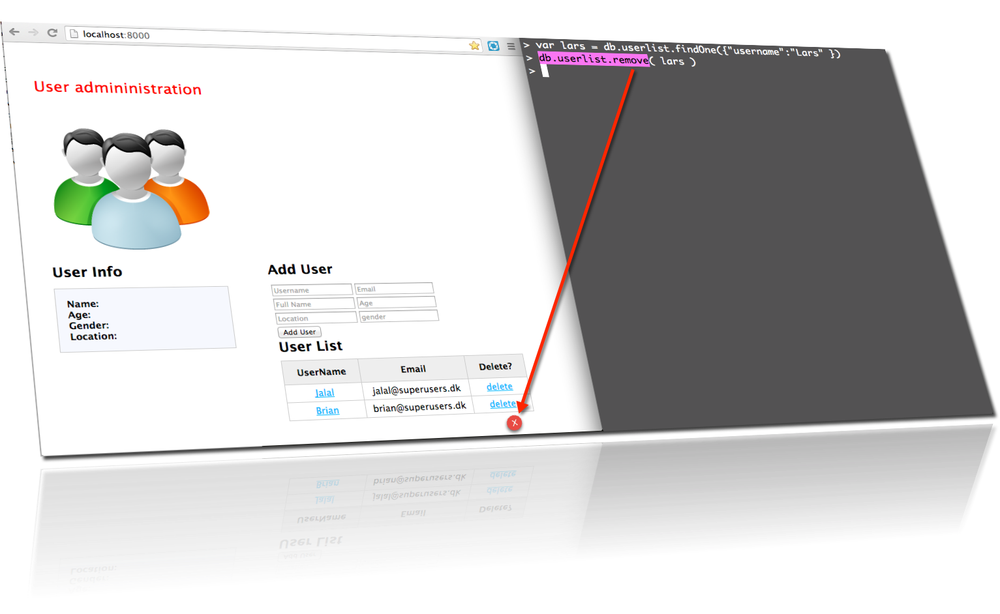
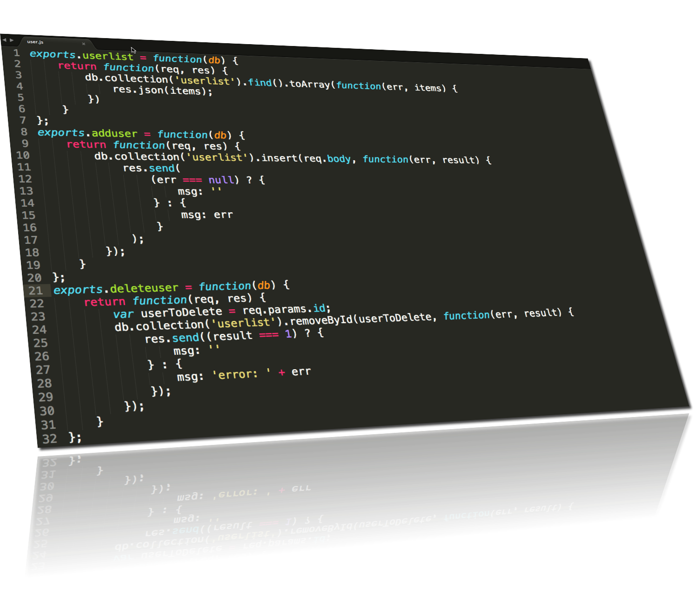
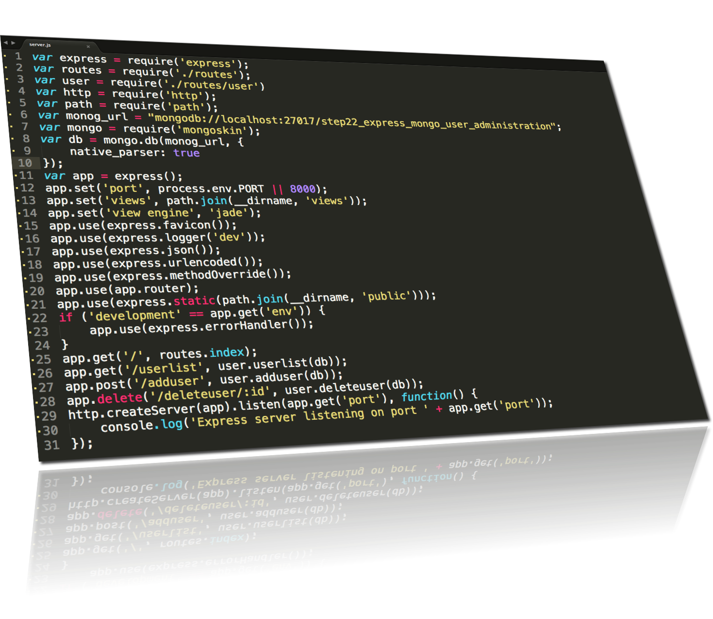

node-step-by-step
=================

## step22_express_mongo_user_administration

    npm install 
    npm start   

start mongo-server then browse to port 8000

    mongod 

    > use step22_express_mongo_user_administration

