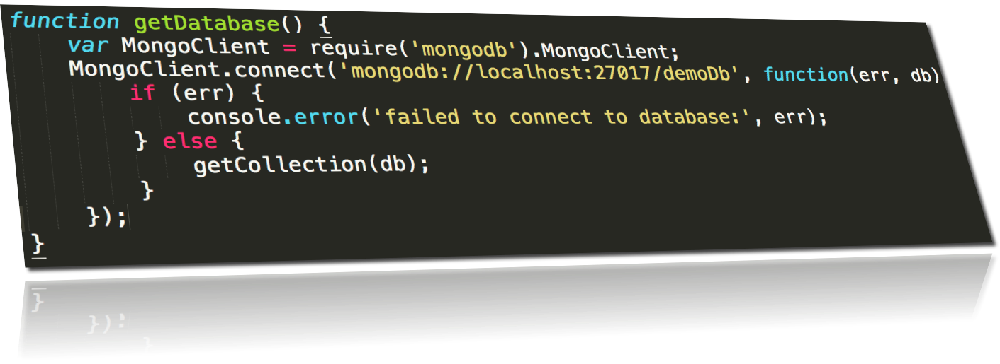
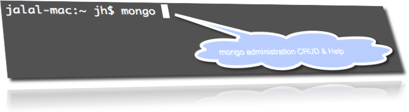
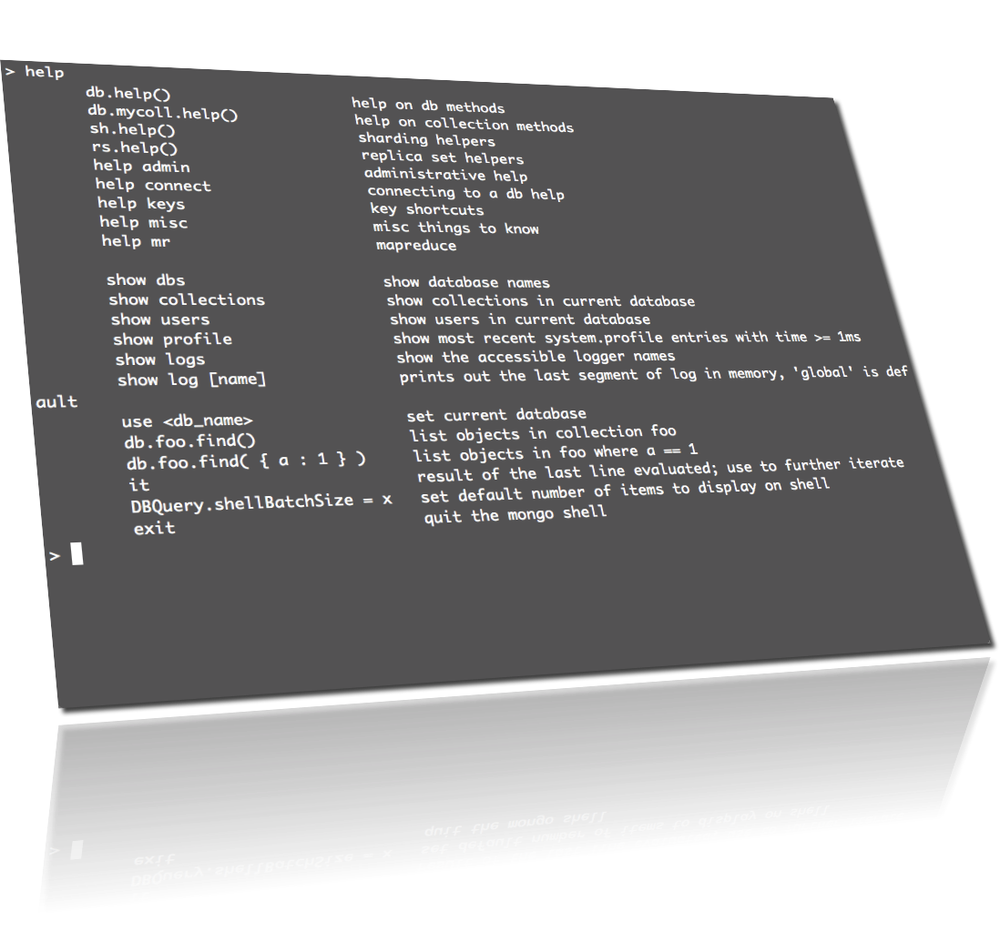
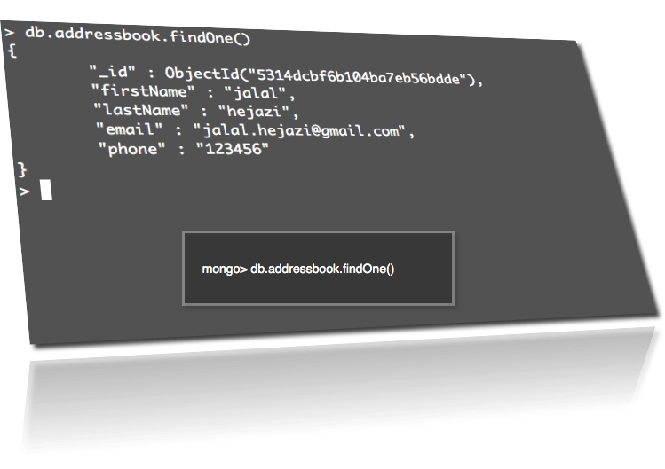

node-step-by-step
=================

building nodejs REST-API-SPA-DB

## Step16_SPA_MongoDB (addressbook)

REST DataService backend and Single Page App frontend

database_name: demoDB

## usage: 

    $ npm install

## start mongod:

    $ mongod
    $ npm start

## mongo administration

    $ mongo

    mongo> help

    mongo> use demoDb 

    mongo> show collections

    mongo> db.addressbook.findOne()

    mongo> db.addressbook.remove({"firstName": "jalal"})

## mongodb homepage

<a href="http://www.mongodb.org/">mongodb.org</a>

<a href="http://docs.mongodb.org/manual/core/crud-introduction/">
    mongodb-crud-introduction
</a>

<a href="http://docs.mongodb.org/manual/core/import-export/">
    import-export-json-data
</a>

