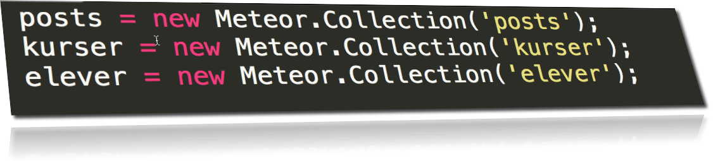
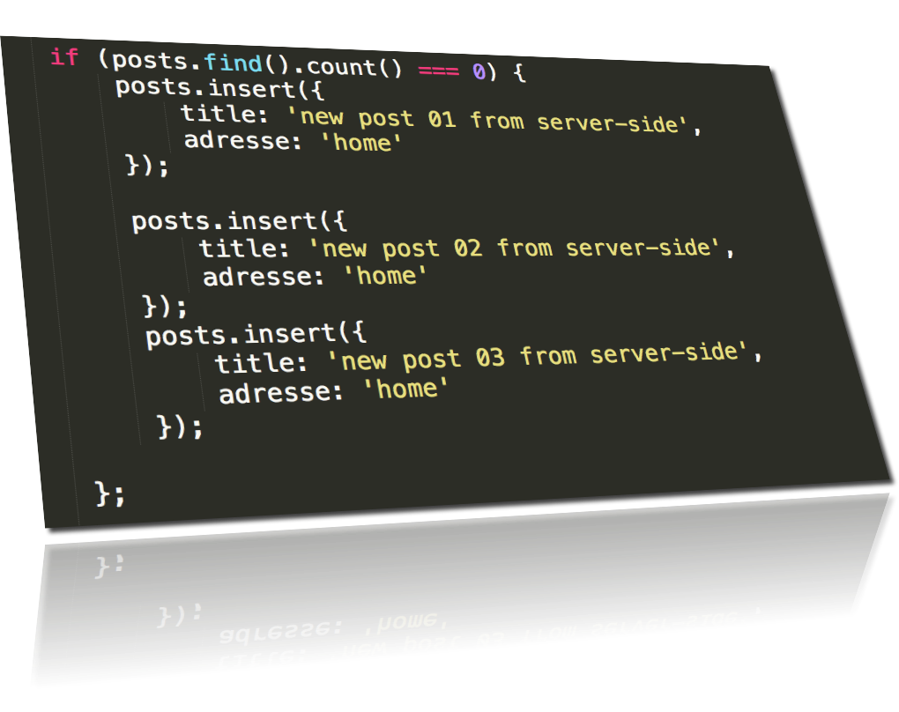
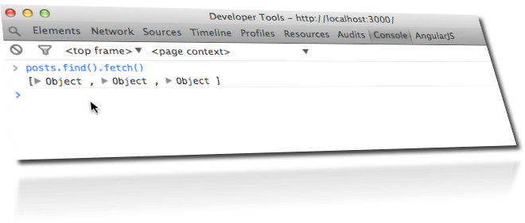

node-step-by-step
=================

## step24_meteor_mongodb

## meteor run
    
    > meteor run

## mongodb run 
mens meteor er i run mode start mongodb med en anden terminal med command

    > meteor mongo

mongodb commands du har har brug for
    
    meteor:PRIMARY> help            // alt hvad du har brug for er i help
    
    meteor:PRIMARY> cls             // clear 

    meteor:PRIMARY> show collections

    meteor:PRIMARY> db.kurser.find()

    meteor:PRIMARY> db.kurser.find().count()

    meteor:PRIMARY> db.kurser.findOne({ "title" : "new kursus 01 from serverside"}) 

    meteor:PRIMARY> db.kurser.insert({test:'nyt kursus på vej'})

    meteor:PRIMARY> var ID = db.kurser.findOne({title:'nyt kursus på vej'})._id
    
    meteor:PRIMARY> db.kurser.remove(ID)  // sletter kursus med ID 

    meteor:PRIMARY> ID                    // forventer null   

    meteor:PRIMARY> ctrl + c              // exit mongo-terminal 

## create mongodb collections 

## insert data in mongodb collections

## browser

## browser console

