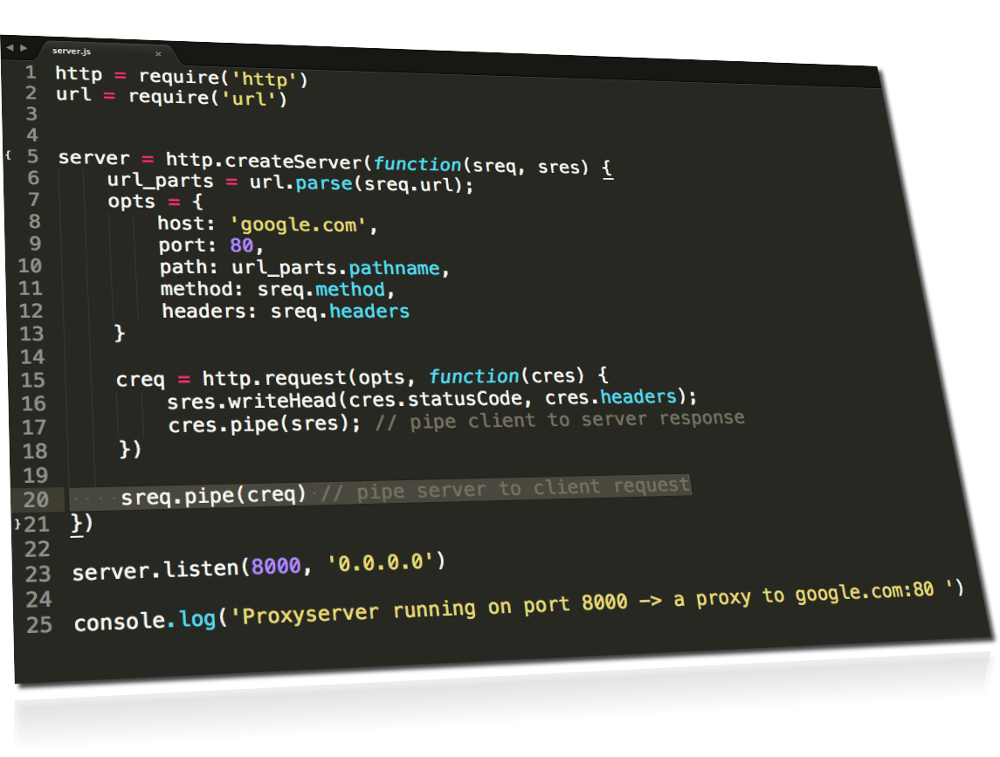
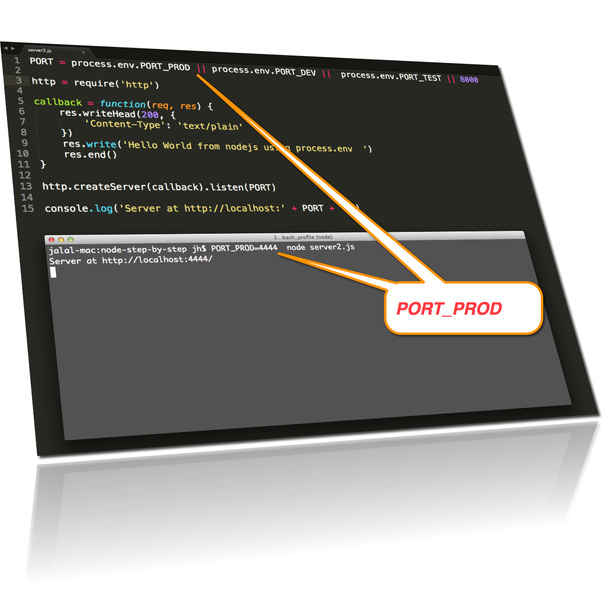

node-step-by-step
=================

building nodejs step by step (building chat server and later client )

## Step03

building the server side.

Solving the problem of NOT to hardcode PORT inside your server.js  
inspiration from: <a href="http://nodejs.org/api/process.html#process_process_env">#process_process_env</a>

