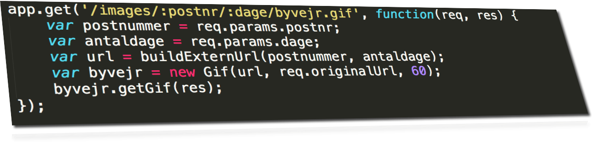
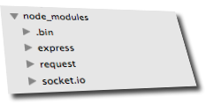
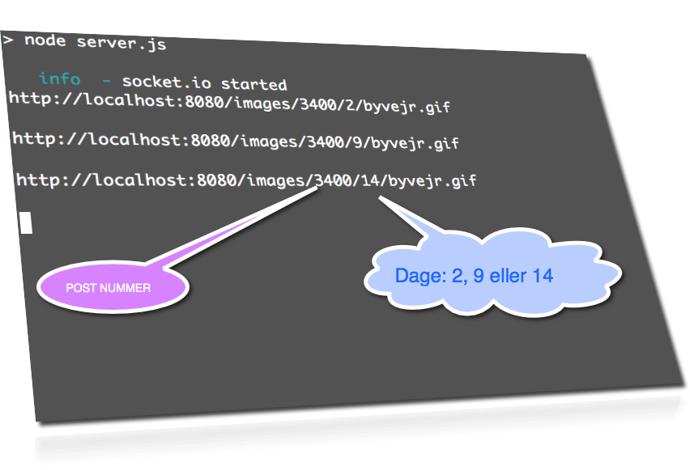

node-step-by-step
=================

building nodejs step by step 

## Step13 (vejret i Danmark)

 

    $ npm install

 

    
    $ npm start

 

 

 

 

 

## HTML5 Mobile WebApp Client

<a href="http://supermobile.dk/html5/WebApp.vejret/">html5/WebApp.vejret </a>

Vejret er en mobil HTML5 WebApp, baseret på følgende Data Services:

Vejrdata stammer fra Danmarks Meteorologiske Institut (DMI).  
Data om postnumrenes grænser stammer fra Danmarks Administrative Geografiske Inddeling (DAGI),  
som Kort & Matrikelstyrelsens (KMS) har ophavsretten til.

