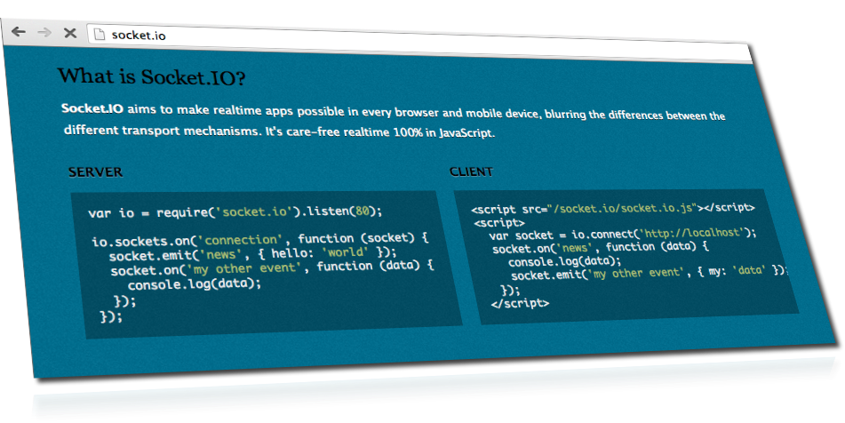
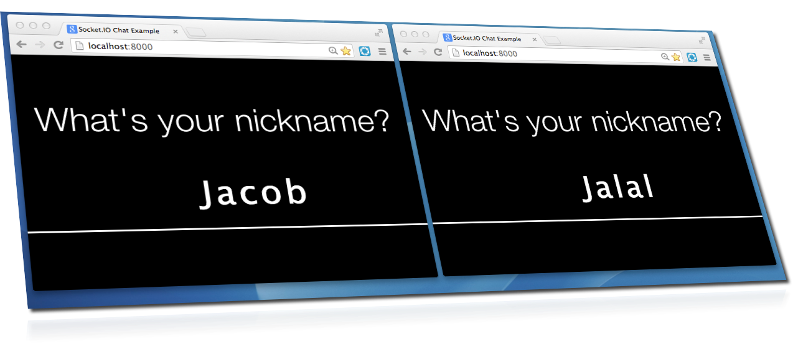
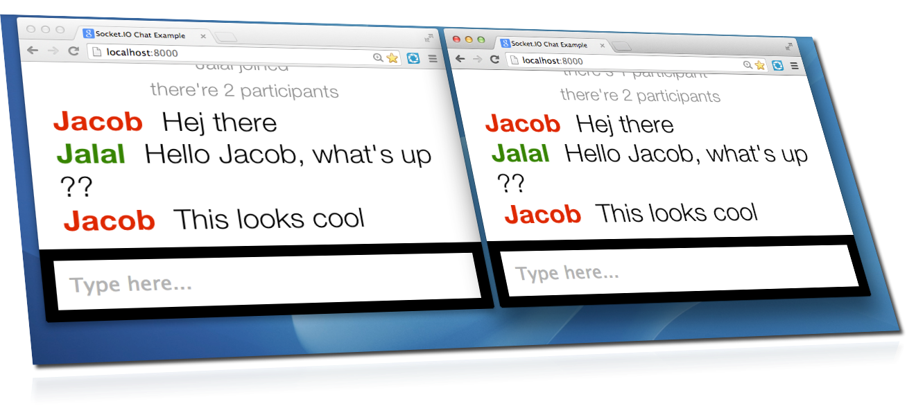

node-step-by-step
=================

building nodejs step by step (building chat server and later client )

## Step11 (Comet and Socket.io)

So... do you want to build a chat? Or a real-time multiplayer game?

In order to build a (soft-) real-time app, you need the ability to update information quickly within the end user's browser.

HTTP was not designed to support full two-way communication. However, there are multiple ways in which the client can receive information in real time or almost real time:

Techniques to implement Comet

<strong>Periodic polling </strong> Essentially, you ask the server whether it has new data every n seconds, and idle meanwhile:

    Client: Are we there yet?
    Server: No
    Client: [Wait a few seconds]
    Client: Are we there yet?
    Server: No
    Client: [Wait a few seconds]
    ... (repeat this a lot)
    Client: Are we there yet?
    Server: Yes. Here is a message for you.

The problem with periodic polling is that: 1) it tends to generate a lot of requests and 2) it's not instant - if messages arrive during the time the client is waiting, then those will only be received later.

<strong>Long polling</strong> This is similar to periodic polling, except that the server does not return the response immediately. Instead, the response is kept in a pending state until either new data arrives, or the request times out in the browser. Compared to periodic polling, the advantage here is that clients need to make fewer requests (requests are only made again if there is data) and that there is no "idle" timeout between making requests: a new request is made immediately after receiving data.

    Client: Are we there yet?
    Server: [Wait for ~30 seconds]
    Server: No
    Client: Are we there yet?
    Server: Yes. Here is a message for you.

This approach is slightly better than periodic polling, since messages can be delivered immediately as long as a pending request exists. The server holds on to the request until the timeout triggers or a new message is available, so there will be fewer requests.

However, if you need to send a message to the server from the client while a long polling request is ongoing, a second request has to be made back to the server since the data cannot be sent via the existing (HTTP) request.

<strong>Sockets/long-lived connections</strong> WebSockets (and other transports with socket semantics) improve on this further. The client connects once, and then a permanent TCP connection is maintained. Messages can be passed in both ways through this single request. As a conversation:

    Client: Are we there yet?
    Server: [Wait for until we're there]
    Server: Yes. Here is a message for you.

If the client needs to send a message to the server, it can send it through the existing connection rather than through a separate request. This efficient and fast, but Websockets are only available in newer, better browsers.

### Socket.io

As you can see above, there are several different ways to implement Comet.

Socket.io offers several different transports:

* Long polling: XHR-polling (using XMLHttpRequest)
* Long polling: JSONP polling (using JSON with padding)
* HTMLFile (forever Iframe for IE)
* Sockets/long-lived connections:(Websockets over plain TCP)  

Ideally, we would like to use the most efficient transport (Websockets) - but fall back to other transports on older browsers. This is what Socket.io does.

## Writing a basic application

Let's start with a package.json:

    {
      "name": "simpleApp",
      "description": "Simple Socket.io app",
      "version": "0.0.1",
      "main": "server.js",
      "dependencies": {
        "socket.io": "0.8.x"
      },
      "private": "true"
    }

install dependencies (socket.io)

    npm install 

start the server

    node server.js

### cool chat examples 

<a href="https://github.com/LearnBoost/socket.io/tree/master/examples">
  https://github.com/LearnBoost/socket.io/tree/master/examples
</a> 

