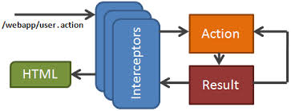
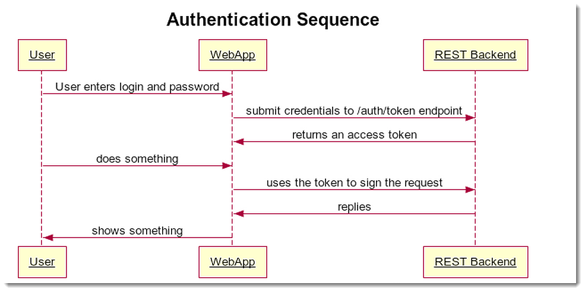

node-step-by-step
=================

## Step21_middleware_sessions

## middleware-session (authentications)

## hashing and salting password

some quick research 

https://www.npmjs.org/package/crypto

https://www.npmjs.org/package/password-hash

https://crackstation.net/hashing-security.htm

 

