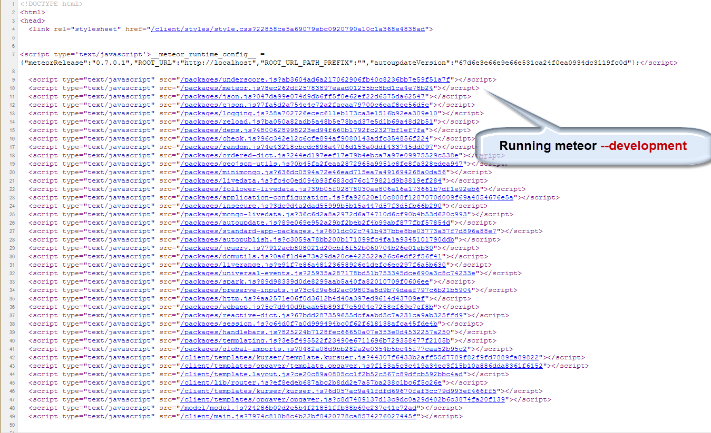
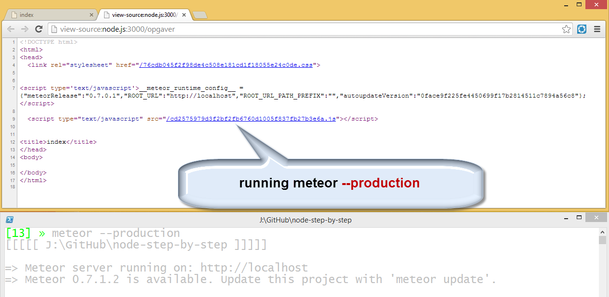
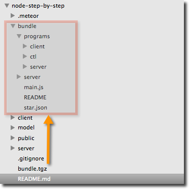
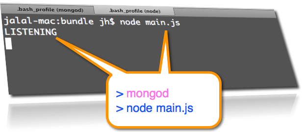
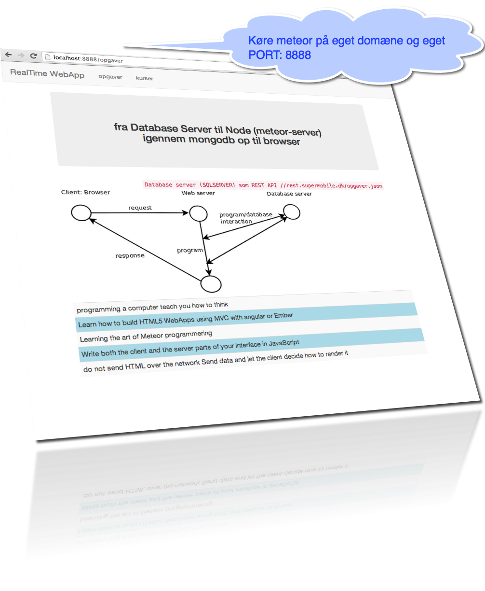
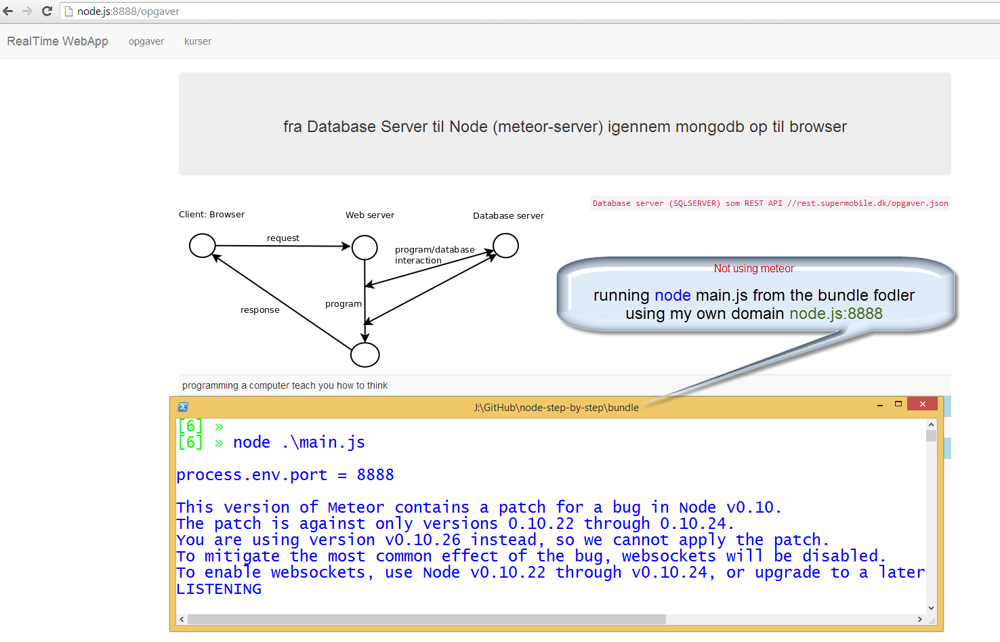
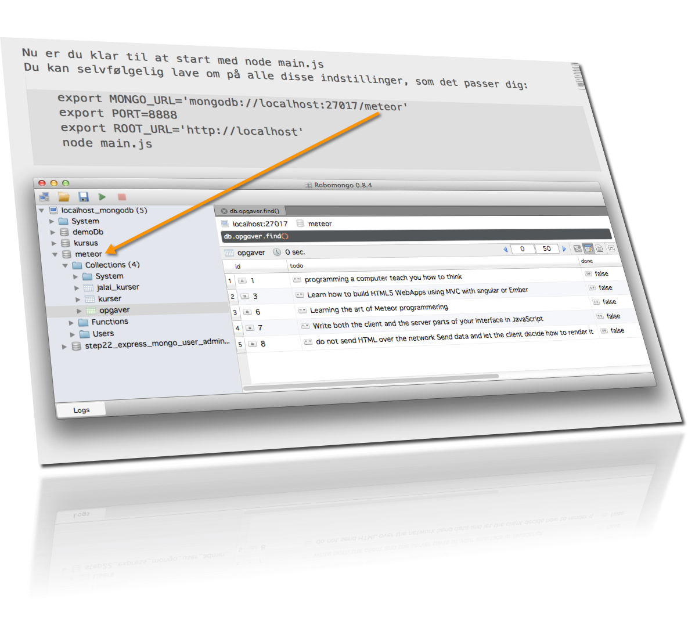
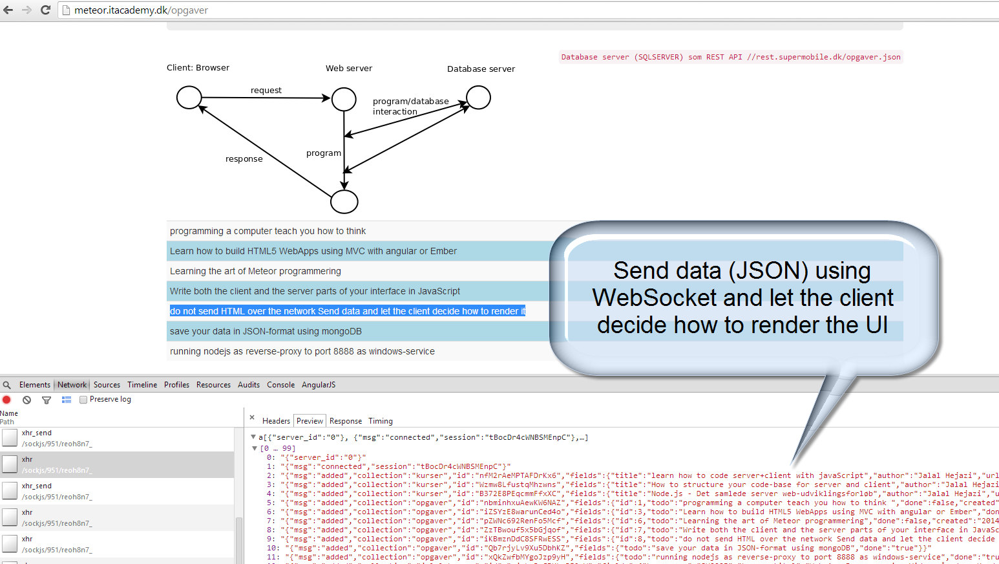

node-step-by-step
=================

## step27_from_meteor_back_to_node

Du kan køre meteor (nodejs) i development-mode

    meteor --development

Du kan nemt skifte til production-mode

    meteor --production

## Cloud hosting eller private hosting

meteor er en fantastisk framework, men jeg ønsker ikke at brug deres cloud server, som de viser i dokumentationen: <a href="http://docs.meteor.com/#meteordeploy">#meteordeploy</a> 

    meteor deploy [sub-domæne].meteor.com

Jeg ønsker at kunne installere mine apps på eget domæne og eget database.

## konfigurere meteor/node på eget domæne (private hosting)

Hvis du følger mine instruktioner her, så ville du kunne selv bestemme både domænet og databasen.

oprette en bundle som tgz format: 

    meteor bundle  bundle.tgz

udpakke til en mappe med navnet bundle:

    tar -xzvf bundle.tgz

skift til den ny bundle mappe

    cd bundle

Det er en god idé at installere mongodb as windows-service (med --install)

    mongod --dbpath=D:\mongodb --logpath=D:\mongodb\log.txt --install

Nu er du klar til at start med node main.js  
Du kan selvfølgelig lave om på alle disse indstillinger, som det passer dig:  

    export MONGO_URL='mongodb://localhost:27017/meteor'
    export PORT=8888
    export ROOT_URL='http://localhost'
    node main.js
    

## Nu kan du glemme alt om meteor 

## start din app med node 

Fedt :-) 

min app opretter en forbindelse til mongodb på localhost 'mongodb://localhost:27017/meteor' 
databasen hedder for nu meteor, som bliver oprettet ved opstart.  
min app opretter forbindelse til servicen rest.supermobile.dk/opgaver.json  
data bliver oprettet kun én gang ved programmet start  

## Hvad betyder RealTime WebApp ?

Realtime betyder at data der ændre sig i databasen bliver automatisk opdateret i alle klienter ved brug af WebSocket/xhr/pooling.  
i node programmering sender man kun de data der ændringer sig fra server til klienter :-)  
Serveren skal ikke sende html+data som man gøre i php og asp.net
 

   

Sidst men ikke mindst: <a href="http://meteor.itacademy.dk">Her er et linkt til min privat hosting på meteor.ITacademy.dk </a>
 

