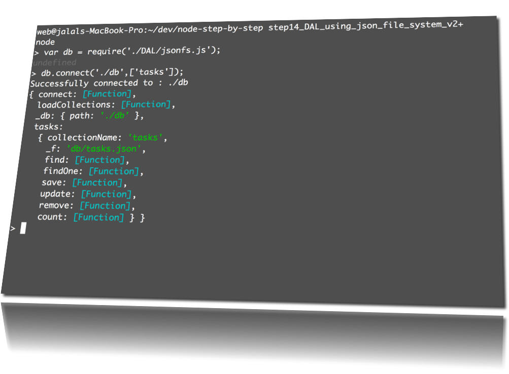

node-step-by-step
=================

building nodejs REST-API-repository-design-pattern

## Step14_DAL_using_json_file_system_v2

 
 

    $ npm install

## Solution

+ use the ./DAL/jsonfs.js as DAL Repository for CRUD.
+ use the ./db/tasks.json as JSON-Database.
+ use the db for all CRUD operations

		// initialize the json database:
		$ node setup_db.js

		// run the app:
		$ npm start
		or
		$ node server.js

### HTTP.GET
#### TaskRepository.prototype.findAll()

		curl http://localhost:8000/tasks/

#### TaskRepository.prototype.find(:id)

		curl http://localhost:8000/tasks/1
		curl http://localhost:8000/tasks/2
		curl http://localhost:8000/tasks/3

### HTTP.POST + HTTP.PUT
#### Save a task (create or update)
#### TaskRepository.prototype.save(:task)

		curl \
			-H "Content-Type: application/json" \
			-d '{"taskId":"100","title":"testing UPSERT using curl"}' \
			http://localhost:8000/tasks/

### HTTP.DELETE
#### TaskRepository.prototype.remove(:id)
		curl -X DELETE "http://localhost:8000/tasks/1"

