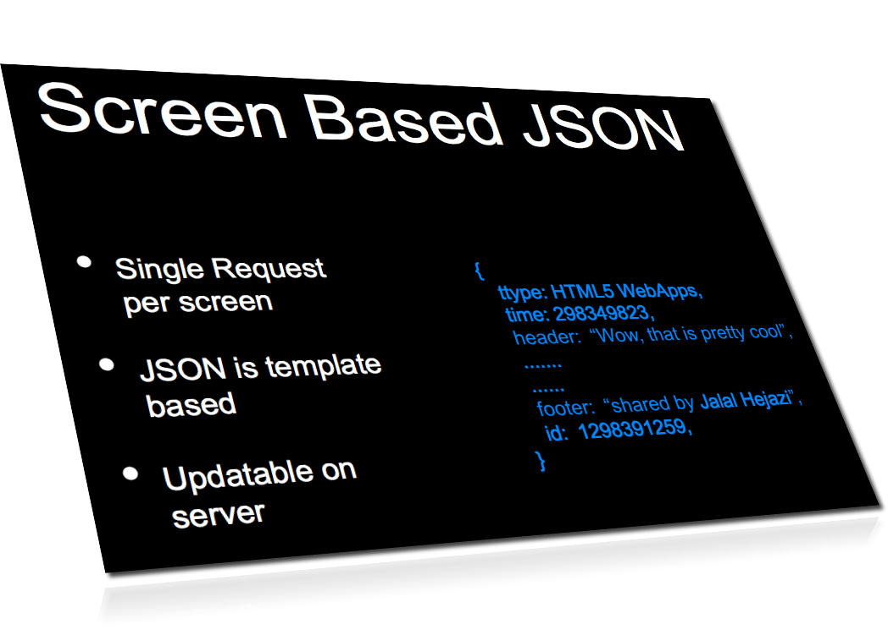

node-step-by-step
=================

building nodejs step by step (building chat server and later client )

## This branch is all about node 

## Write your first node webserver code:
write the code as shown in the image

~~~
 //test your server with node 

 $ node server.js 

~~~

